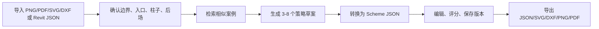
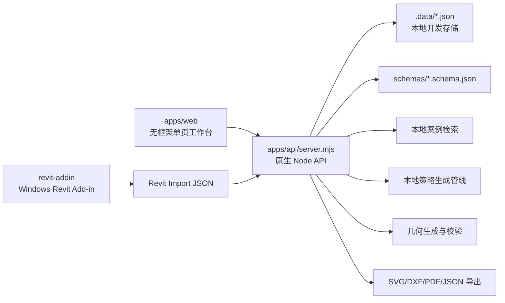

# 商业空间 AI 头脑风暴工具

面向商业空间早期方案阶段的 Web/API MVP。用户导入平面图或 Revit Import JSON，手动确认边界、入口、人流权重、柱子、后场等约束，系统参考案例库生成多个功能落位策略，并转换为可编辑、可评分、可导出的 Scheme JSON。

当前项目适合演示、内部验证和 beta fixture 测试；还不是生产级 SaaS 或施工图生成工具。

## 适合用户

- 商业空间设计团队
- 室内设计工作室
- 连锁品牌门店设计团队
- 商场招商和资产运营团队
- 办公空间 test-fit 团队

## 核心工作流



## 当前能力

- Web 工作台：项目创建、图纸上传、锁定底图、手动标注边界/入口/柱子/后场。
- 案例库：导入 20 个 seed cases，本地特征/RAG 检索相似案例。
- AI 头脑风暴：基于 Project JSON、brief、参考案例生成 3-8 个策略草案。
- Scheme 生成：把策略草案转换成 schema-valid Scheme JSON。
- 几何校验：边界裁剪、家具基础碰撞、门洞净空、柱子避让。
- 编辑版本：JSON 编辑器支持撤销、重做、保存版本快照。
- 导出：JSON、SVG、DXF、PNG、摘要 PDF。
- Revit 路径：Windows C# Revit 2025 Add-in 脚手架，导出 Revit Import JSON 后导入 Web 项目。

## 技术架构



## 快速运行

```bash
npm run dev
```

默认地址：

```text
http://127.0.0.1:4173
```

## 验证

```bash
node --check apps/api/server.mjs
node --check apps/web/app.js
python3 scripts/validate_schemas.py
```

完整 UI 验证使用 Playwright/Codex browser against `http://127.0.0.1:4173`。

## 关键目录

```text
apps/api/server.mjs        # 原生 Node API、静态服务、本地 AI/几何/导出逻辑
apps/web/                  # Web 工作台
schemas/                   # Project / Scheme / Case / Revit Import JSON Schema
samples/                   # 示例 JSON、seed cases、beta fixture intake
docs/                      # 产品、架构、beta 验证和导出说明
revit-addin/               # Windows Revit Exporter Add-in scaffold
.data/                     # 本地开发数据 store，已被 .gitignore 忽略
```

## 重要限制

- 当前 AI 管线是本地 deterministic prompt pipeline，没有调用外部 LLM 或付费模型。
- 本地 `.data` 是开发 store，不是生产数据库或对象存储。
- 当前网页端不能直接导入 `.rvt`；Revit 文件需要先通过 Windows Revit Add-in 导出为 JSON。
- Revit Add-in 需要 Windows + Revit 2025 + dotnet SDK 才能编译和运行验证。
- 生成图纸适合 brainstorming 和 test-fit 讨论，不承诺施工图、消防、审图或规范合规。
- PDF 是 MVP 摘要 PDF，不是最终汇报排版。
- DXF 输出使用基础实体，进入生产 CAD 工作流前需要真实软件兼容性测试。

## 当前阶段

Phase 0-5 已完成 MVP 闭环。Phase 6 正在做 beta hardening 和真实项目验证。

已完成：

- 多 agent goal runbook 和自动 PR 协议。
- 10 类 beta fixture 验证计划和 intake 规则。

待完成：

- Windows/Revit 2025 运行验证，并补 Revit 2026 路径。
- 真实 LLM/provider adapter 决策门和评估 harness。
- beta run 的检索、几何、导出质量报告。
- beta release verification 和 PR。

## 文档入口

- [代码库现状分析](docs/codebase-analysis.md)
- [MVP 范围确认](docs/mvp-scope.md)
- [JSON Schema v0](docs/json-schema-v0.md)
- [Demo Flow](docs/demo-flow.md)
- [Beta Validation Plan](docs/beta-validation-plan.md)
- [Export Package v0](docs/export-package-v0.md)
- [Revit Add-in 开发方案](revit-json-addin-windows-development-plan.md)
